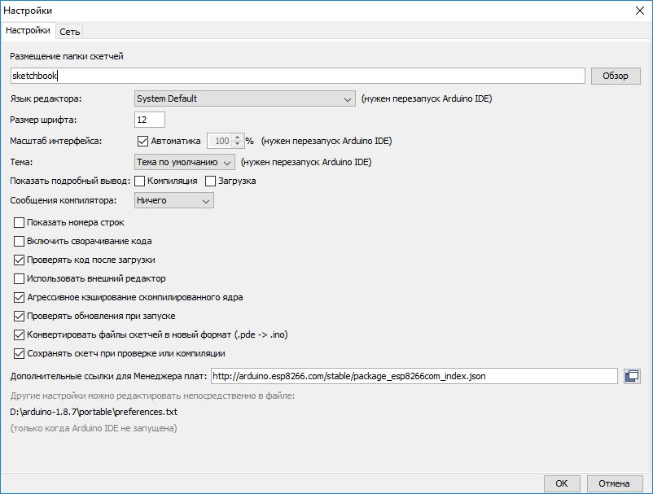
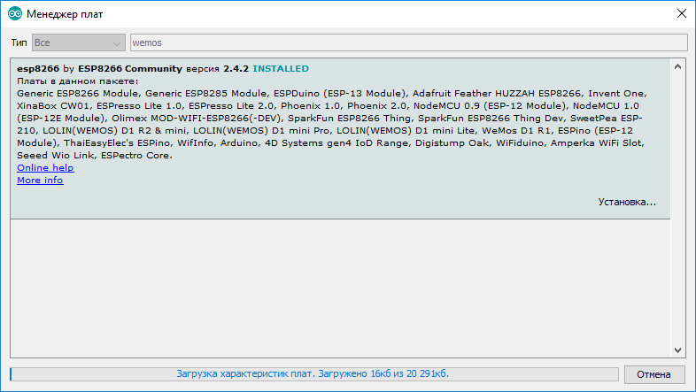
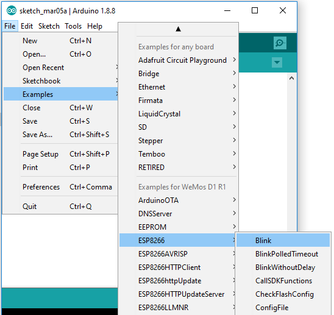
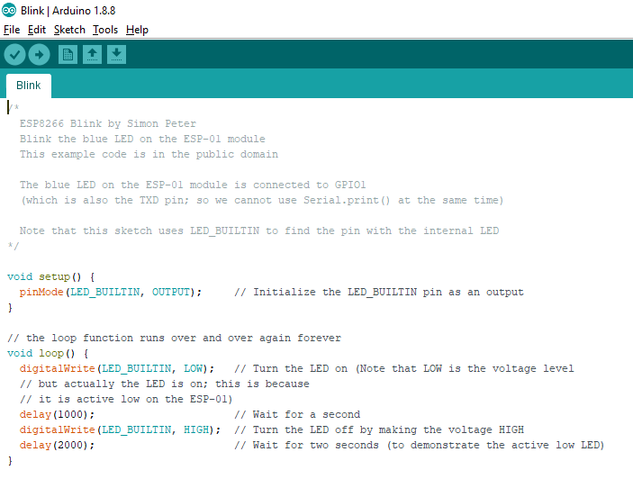
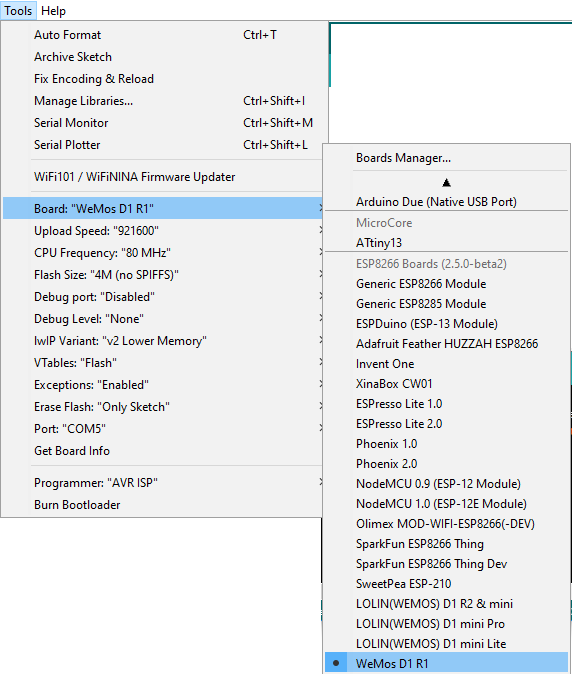
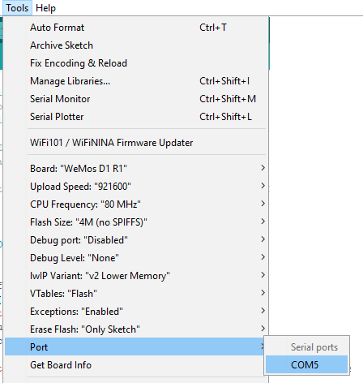
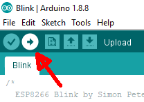
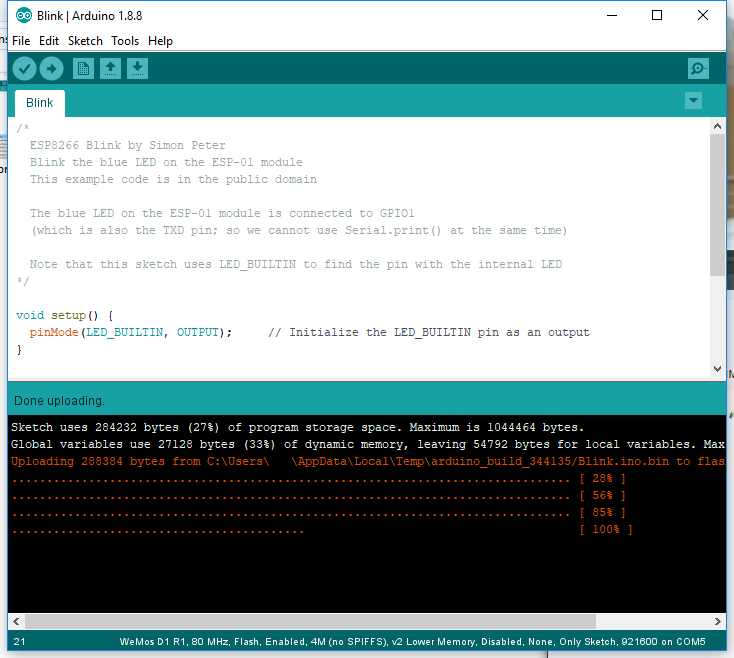

Start Arduino and open Preferences window.
Enter http://arduino.esp8266.com/stable/package_esp8266com_index.json into Additional Board Manager URLs field. You can add multiple URLs, separating them with commas.

Open Boards Manager from Tools > Board menu and install esp8266 platform 

Install library from
https://github.com/knolleary/pubsubclient

Для подготовки к работе сначала зальем простую программу, в терминах Ардуино она называется "скетч" для проверки работоспособности системы и правильности настроек.
Готовый код можно получить из среды Ардуино:
File/Examples/ESP8266/Blink

Получившийся результат должен выглядеть примерно так:

А готовый к работе контроллер с подключенным USB кабелем так:

После подключения контроллера к компьютеру могут потребоваться дополнительные драйвера, в этом случае инструктор подскажет, что делать.

Когда всё установлено и настроено, надо
1. Выбрать нужную плату из настроек - меню Tools > Board

2. Выбрать COM порт. Если там их два, то выбрать с максимальным номером.

3. Нажать кнопку Upload для компиляции и записи программы на контроллер.

4. Если всё прошло хорошо и нет сообщений об ошибке, то скетч записался в память контроллера, а синий светодиод на нём стал периодически мигать
