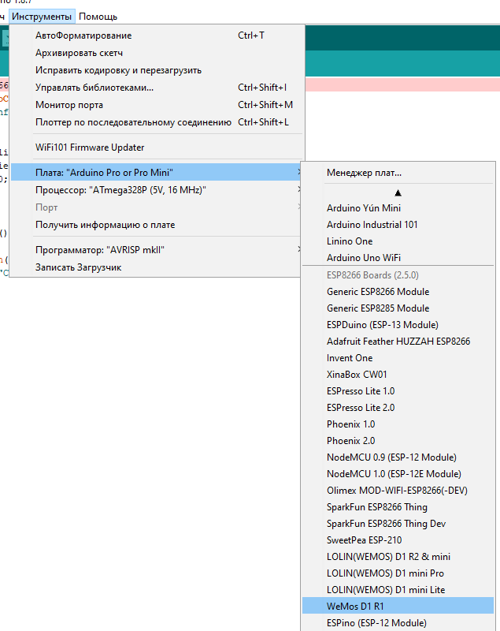

Start Arduino and open Preferences window.
Enter http://arduino.esp8266.com/stable/package_esp8266com_index.json into Additional Board Manager URLs field. You can add multiple URLs, separating them with commas.

Open Boards Manager from Tools > Board menu and install esp8266 platform 

Select your Wemos D1 R1 board from Tools > Board menu after installation

Install library from
https://github.com/knolleary/pubsubclient