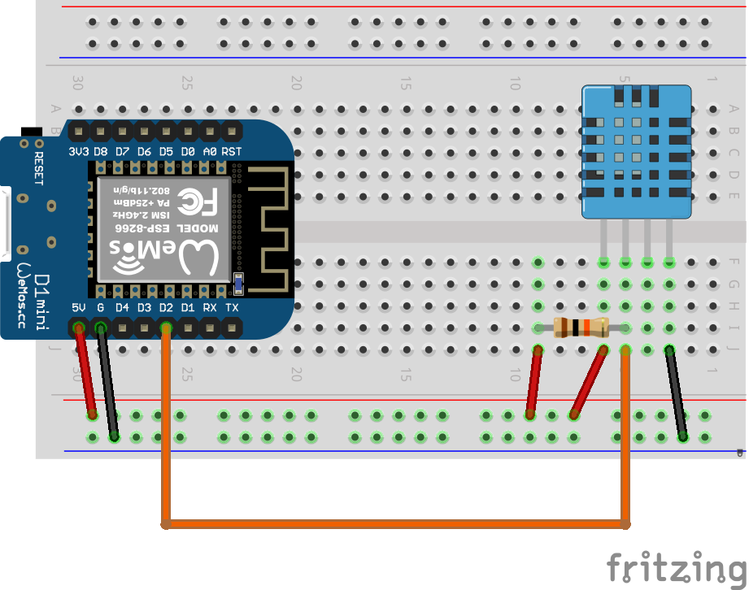

# Датчик влажности и температуры DHT11

DHT11 Humidity & Temperature Sensor

[Datasheet]: https://www.mouser.com/ds/2/758/DHT11-Technical-Data-Sheet-Translated-Version-1143054.pdf

Датчик DHT11 позволяет измерять температуру и влажность воздуха.

|                 | Min  | Max  | Accuracy |
| --------------- | ---- | ---- | -------- |
| Температура     | 0    | 50   | 2        |
| Влажность       | 20%  | 90%  | 1%       |
| Время измерения | 6 с  | 30 с |          |

Библиотеку для поддержки можно скачать здесь: 
https://github.com/adafruit/DHT-sensor-library
https://github.com/adafruit/Adafruit_Sensor

Типовой пример подключения:



У нас используется готовый модуль, который уже содержит все необходимые элементы, поэтому подключение будет еще проще.

# #TODO схему


Минимальный код для запуска:

```С
#include <Adafruit_Sensor.h>
#include <DHT.h>
#include <DHT_U.h>
#define DHTPIN 2     // Digital pin connected to the DHT sensor 
#define DHTTYPE    DHT11
DHT_Unified dht(DHTPIN, DHTTYPE);

uint32_t delayMS;

void setup() {
  Serial.begin(115200);  
  dht.begin();  
  sensor_t sensor;
  dht.temperature().getSensor(&sensor);
  dht.humidity().getSensor(&sensor);
  delayMS = sensor.min_delay / 1000;
}

void loop() {
  delay(delayMS);
  sensors_event_t event;
  dht.temperature().getEvent(&event);
  if (isnan(event.temperature)) {
    Serial.println(F("Error reading temperature!"));
  }
  else {
    Serial.print(F("Temperature: "));
    Serial.print(event.temperature);
    Serial.println(F("°C"));
  }
  dht.humidity().getEvent(&event);
  if (isnan(event.relative_humidity)) {
    Serial.println(F("Error reading humidity!"));
  }
  else {
    Serial.print(F("Humidity: "));
    Serial.print(event.relative_humidity);
    Serial.println(F("%"));
  }
}
```


У данного программного кода есть один недостаток - используется функция delay(), которая блокирует выполнение остальных задач контроллера. В случае, когда осуществляется соединение с сетью по MQTT лучше использовать другой подход - запоминать в переменной время последнего измерения и запускать процесс измерения только если текущее время (функция 

[millis()]: https://www.arduino.cc/reference/en/language/functions/time/millis/

 или таймер)