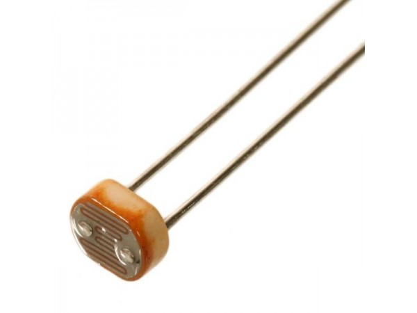
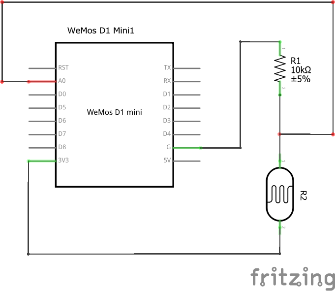
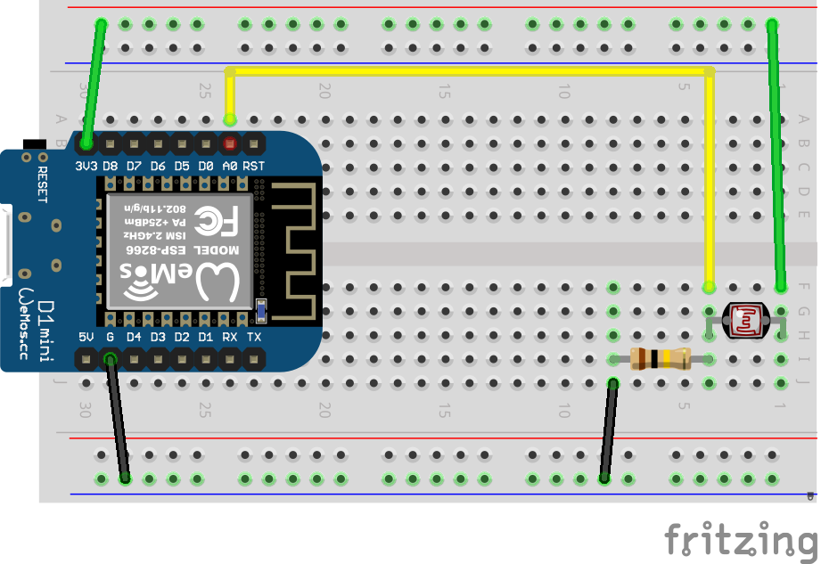
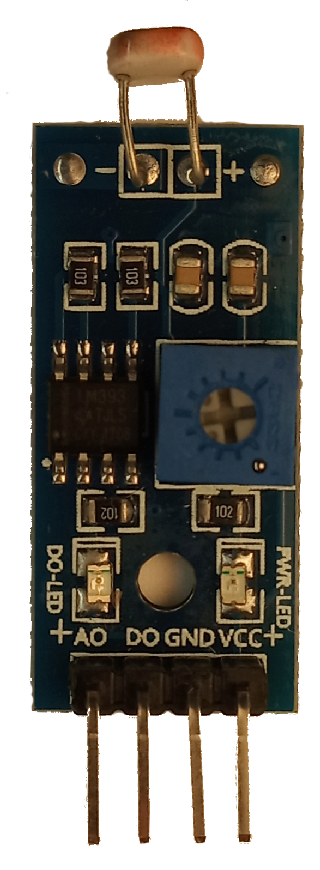

# Измерение освещенности

Используется фоторезистор VT93N2

[Datasheet](http://www.farnell.com/datasheets/919043.pdf)

**Спецификация:**

- максимальная потребляемая мощность: 100 мВт;
- спектральный пик: 540 нм;
- сопротивление при освещении 10 люкс :от 2 до 5 кОм;
- сопротивления в темноте: 500 кОм.

Для измерения его сопртивления используется аналоговый вход A0 микроконтроллера. Потребуется построить небольшу. схему, называемую делитель напряжения.

Используемый нами модуль содержит дополнительные элементы (будут нужны в другой задаче), но при этом позволяет использовать фоторезистор напрямую. Для этого надо подключиться к ножкам A0 и GND модуля.

Для считывания показаний достаточно использовать функцию `analogRead(A0)`, которая возвращает число в зиапазоне от 0 до 1024 (напряжение от 0 до 1 вольта)