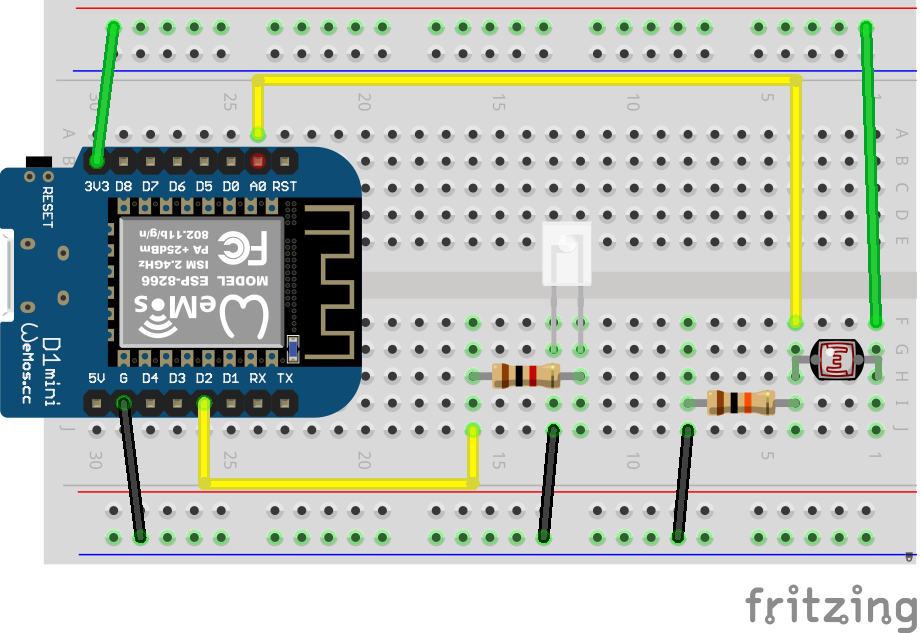

# Адаптивное освещение

При снижении уровня освещения можно компенсировать недостаток света увеличивающейся яркостью лампы. Чтобы в полной темноте лампа горела на полной яркости, а на свету светила на минимальной яркости или вообще выключалась.

Также следует предусмотреть режим, когда по внешней команде можно будет изменять яркость вручную.

Для измерения уровня освещения используется фоторезистор VT93N2

[Datasheet](http://www.farnell.com/datasheets/919043.pdf)


**Спецификация:**

- максимальная потребляемая мощность: 100 мВт;
- спектральный пик: 540 нм;
- сопротивление при освещении 10 люкс :от 2 до 5 кОм;
- сопротивления в темноте: 500 кОм.

Для измерения его сопротивления используется аналоговый вход A0 микроконтроллера. Потребуется построить небольшую схему, называемую делитель напряжения.





Используемый нами модуль с фоторезистором содержит дополнительные элементы (будут нужны в другой задаче), но при этом позволяет использовать фоторезистор напрямую. Для этого надо подключиться к ножкам A0 и GND модуля.


Для считывания показаний достаточно использовать функцию `analogRead(A0)`, которая возвращает число в диапазоне от 0 до 1024 (напряжение от 0 до 1 вольта).

Для изменения яркости свечения будем использовать ШИМ регулирование. В случае с ESP8266 функция [analogWrite](https://www.arduino.cc/reference/en/language/functions/analog-io/analogwrite/) в качестве второго параметра принимает значения от 0 до 1023

Пример:

```c++
#define LED D2

void setup() {
  pinMode(LED,OUTPUT);
}

void loop() {
  Serial.println("40 % PWM");
  analogWrite(LED,410);
  delay(2000);

  Serial.println("100 % PWM");
  analogWrite(LED,1024);
  delay(2000);
}
```


Задача - написать прошивку, которая 

1. будет измерять текущий уровень освещенности и направлять его числом в топик **rtfbest/alight/status**, 
2. рассчитывать дополнительную яркость (логику придумайте самостоятельно) и направлять её в топик **rtfbest/alight/pwm_value**, заодно изменяя яркость светодиода (он будет выступать в роли лампы)
3.  при получении числа до 1024 в топик **rtfbest/alight/pwm_override **будет изменять на 10 секунд яркость светодиода
