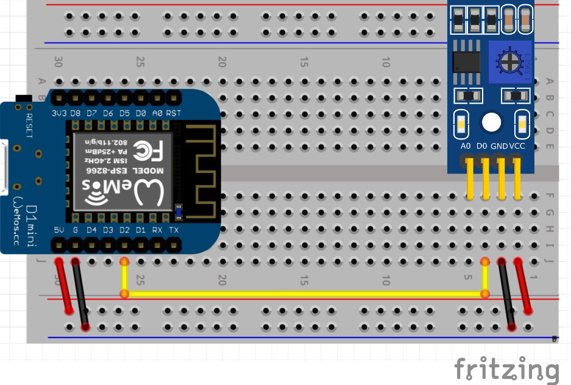

## Свет в подъезде

Чаще всего требуется просто зафиксировать значение освещения "достаточно темно, пора включать свет" или "достаточно светло, можно выключить свет".

В этом случае можно дополнить фоторезистор логикой на основе компаратора LM393 и подстроечного резистора. В итоге компаратор будет сравнивать заданный подстроечным резистором сигнал (сопротивление) с сигналом от фоторезистора и будет выдавать 1 или 0 в зависимости от разницы сигналов.

Схема получается в этом случае крайне простой (потребуется крестовая отвертка для настройки порога срабатывания).

Задача - написать прошивку, которая 

1. будет обрабатывать ([digitalRead](https://www.arduino.cc/reference/en/language/functions/digital-io/digitalread/)) срабатывание датчика и отправлять сигнал - "1" если света достаточно и "0"  если света мало, в топик **rtfbest/dlight**, 
2. Зажигать светодиод если света нет (аналогично задаче 2, но просто зажигать светодиод с помощью [digitalWrite](https://www.arduino.cc/reference/en/language/functions/digital-io/digitalwrite/) )

