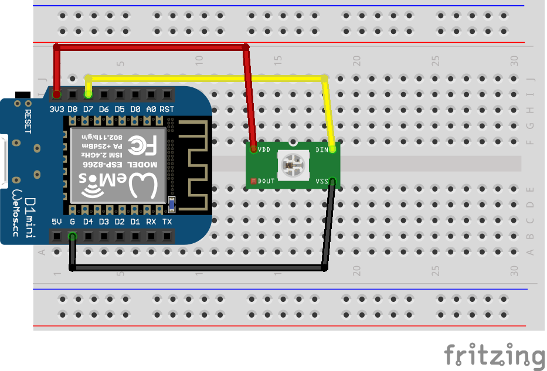

# RGB-светодиоды

В качестве основы для построения умной лампы будем использовать адресные светодиоды WS2812B (Neopixel).


Для удобства работы провода уже распаяны и закреплены термоусадочной трубкой. Черный провод - GND, красный провод - +5 V (используем цветовую маркировку блоков питания ATX :), желтый - сигнальный - DATA.


Логика работы простая - все адресные светодиоды кроме собственно RGB светодиода содержат контроллер, который получает поток данных, обрабатывает его и направляет дальше. Обычно они объединяются в цепочку друг за другом.

Описание протокола работы из Datasheet:


Логика обработки - по сигнальному проводу отправляется цепочка байт. Каждые 3 байта - это компоненты RGB цветового сигнала. Первый адресный контроллер вырезает и использует первые три байта из направленного ему потока данных, направляя дальше остальной поток без изменений. Соответственно на уровне программы следует заранее знать, сколько светодиодов будет в цепочке.

Библиотека <https://github.com/adafruit/Adafruit_NeoPixel> содержит всё необходимое для работы.




Пример готового устройства. Конденсатор используется для повышения стабильности по питанию, резистор для ограничения силы тока, а зелёный провод ничего не соединяет, просто было удобно закрепить :)


Пример кода для работы:

```c++
#include <Adafruit_NeoPixel.h>

#define PIN            D2
#define NUMPIXELS      8
#define BRIGHTNESS     50

// Parameter 1 = number of pixels in strip
// Parameter 2 = Arduino pin number (most are valid)
// Parameter 3 = pixel type flags, add together as needed:
//   NEO_KHZ800  800 KHz bitstream (most NeoPixel products w/WS2812 LEDs)
//   NEO_GRB     Pixels are wired for GRB bitstream (most NeoPixel products)
Adafruit_NeoPixel strip = Adafruit_NeoPixel(NUMPIXELS, PIN, NEO_GRB + NEO_KHZ800);

int delayval = 50;
int r,g,b,j  = 0;

void setup() {
  strip.begin(); // This initializes the NeoPixel library.
}

void loop() {
  colorWipe(strip.Color(0, 0, 0), 50);    // Black/off
  colorWipe(strip.Color(255, 0, 0), 50);  // Red
  colorWipe(strip.Color(0, 255, 0), 50);  // Green
  colorWipe(strip.Color(0, 0, 255), 50);  // Blue

  delay(100);
}

void colorWipe(uint32_t c, uint8_t wait) {
  for(uint16_t i=0; i<strip.numPixels(); i++) {
    strip.setPixelColor(i, c);
    strip.show();
    delay(wait);
  }
}
```

Задача: 

Задача - написать прошивку, которая будет зажигать все светодиоды одним цветом, полученным из топика **rtfbest/rgb_lamp**  (subscribe)

