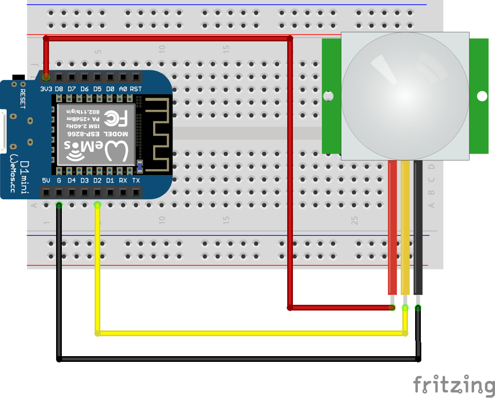
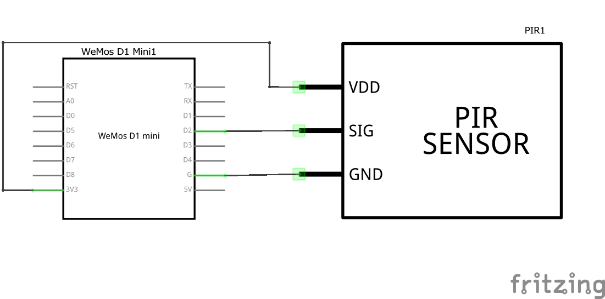
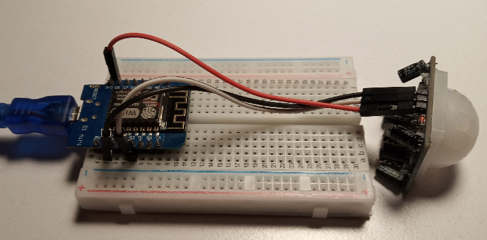

# Охранная система

Для обнаружения движения достаточно хорошо работают детекторы тепла (PIR датчики). Суть сводится к тому, что однопиксельный "тепловизор" накрывается специальной линзой, которая при любом движении нагретого объекта перед устройством будет посылать переменные сигналы. При обнаружении изменения простейший триггер переключается в режим тревоги.





Для экономии на деталях предлагаю в случае тревоги мигать встроенным светодиодом (BUILTIN_LED) и молча отсылать сообщение на сервер.

Пример кода:

```c++
int Status = BUILTIN_LED;
int sensor = D2;

void setup() {
  pinMode(sensor, INPUT);   // declare sensor as input
  pinMode(Status, OUTPUT);  // declare LED as output
}

void loop() {
  long state = digitalRead(sensor);
    if(state == HIGH) {
      digitalWrite (Status, LOW);
      delay(1000);
    }
    else {
      digitalWrite (Status, HIGH);
      delay(1000);
      }
}
```



Задача - при обнаружении движения отослать сообщение в топик **rtfbest/guard** и помигать светодиодом (или капканом (или сиреной (или на ваш выбор)))