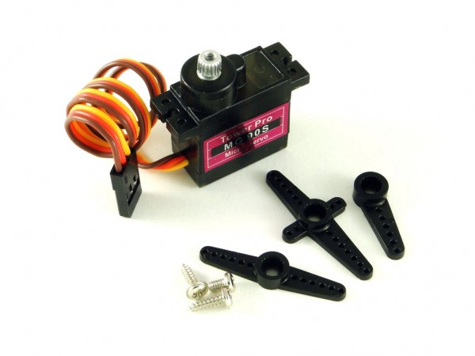
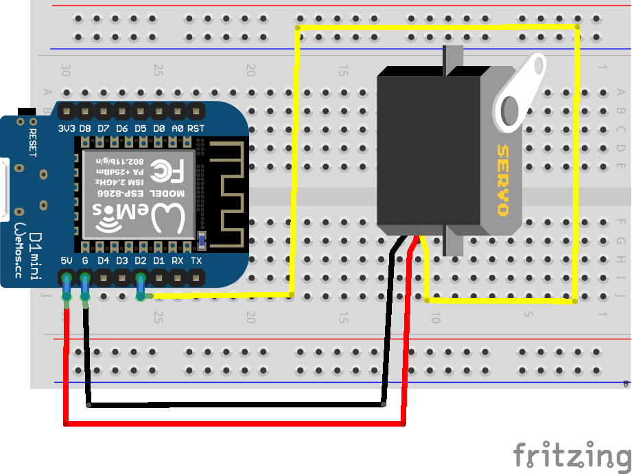
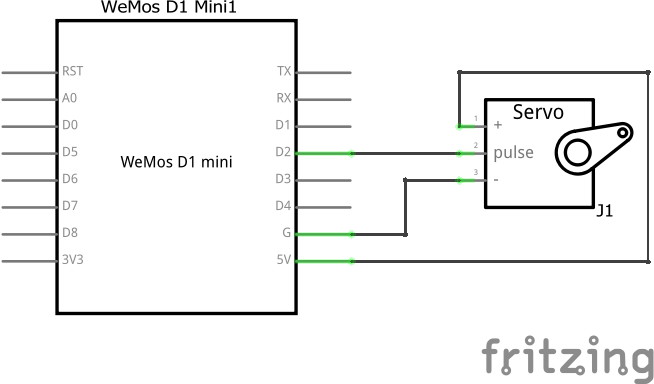
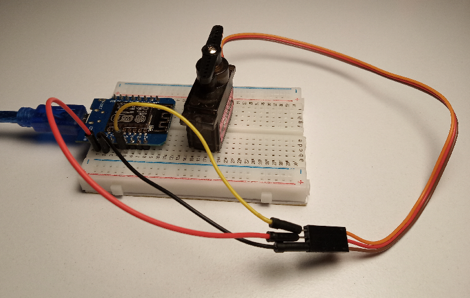

# Умные жалюзи

Умные жалюзи должны быть достаточно умны, чтобы открываться и закрываться без лишнего напоминания.

Благодаря тому, что жалюзи основную часть дня остаются на месте и лишь немного вращаются, лучше всего здесь будет сервопривод, который тоже не любит слишком сильно и далеко вращаться.

У нашего сервопривода имеется три контакта:

- коричневый — GND;
- красный — питание +5V;
- оранжевый (или желтый) — сигнальный.

В среде Arduino уже есть готовый пример кода для управления сервоприводом, поэтому мы предпочтем обойтись без лишних подробностей. Подсказка - **analogWrite**() (PWM), который замечательно работает в связке с [**map()**](https://www.arduino.cc/reference/en/language/functions/math/map/)

Задача:

1. По команде в mqtt топик **rtfbest/blinds** поворачивать привод жалюзи на определенный угол. Данные будут приходить числом от 0 до 100%, как пересчитать в 180 градусов угла? :)
2. Совместить на сервере логику поведения жалюзи и показания датчика света
3. Реализовать возможность открытия по будильнику (опять же команда с сервера)