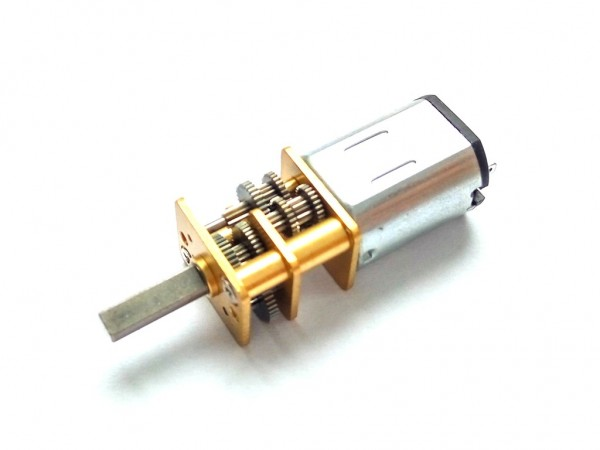
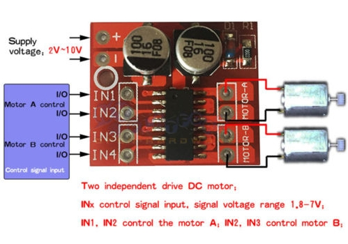
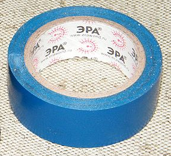
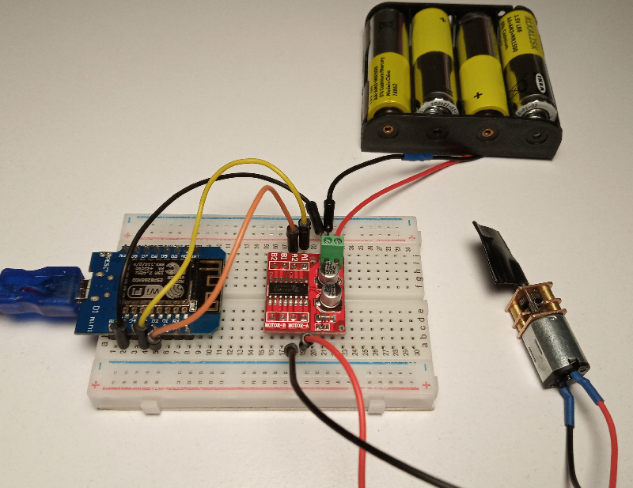

# Умные шторы

Старинная русская пословица гласит "Хочешь жить - умей вертеться". Если нам хочется жить в полном комфорте, придется научиться вертеть приводом для штор.

Задача не требует высокой скорости и большой точности, но при этом требует развивать достаточно заметное усилия, поэтому здесь пригодится электродвигатель с редуктором.

Он способен создавать крутящий момент 2.5 килограмма при рычаге в 1 см, что хватит двигать большинство штор по горизонтали и даже поднимать не слишком тяжелые шторы по вертикали. Но при этом он уже способен потреблять довольно большой ток (около 500 мА), что уже слишком много для обычного контроллера, поэтому потребуется использовать специальный драйвер, который сможет пропускать через себя достаточный ток.

Процесс подключения достаточно прост - внешнее питание подключаем сверху, при этом главная тонкость - **GND контроллера и источника питания должен быть соединён**. Слева на один из пинов подаём питание. При этом в зависимости от пина, на который подано питание, мотор будет вращаться в одну или в другую сторону. Двигатель подключаем справа.

На вал двигателя при помощи главной скрепляющей силы всех DIY - Soviet Duct Tape можно будет в дальнейшем прикрепить трос штор.

Управление крайне просто - просто пишем HIGH на один из пинов и двигатель крутится.

**ВНИМАНИЕ. Сначала подаём LOW на оба пина, а затем только на один из пинов подаем HIGH**. 
**Если подать питание на два пина, есть шанс спонтанного возникновения белого дыма.**

Задача - при поступлении числа в топик **rtfbest/curtains/left** или **rtfbest/curtains/right** двигатель должен крутиться указанное в сообщении количество секунд в указанном (топиком) направлении.

Желательно также предусмотреть использование концевых выключателей (обычных кнопок), которые смогут досрочно остановить вращение двигателя.