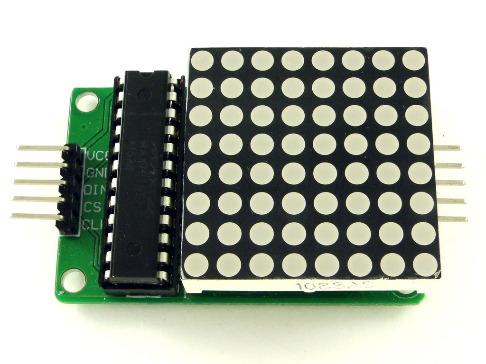
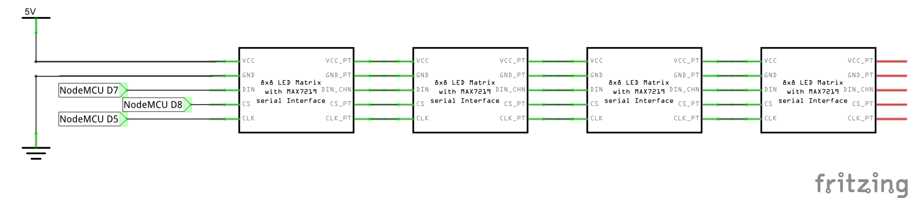
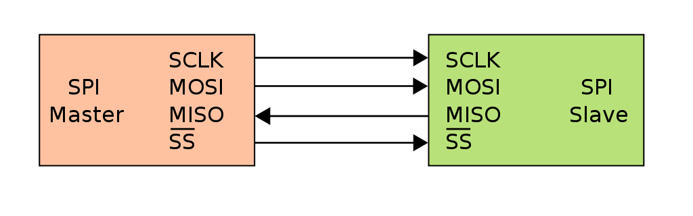

# Просто умный экран


### 
Что может быть лучше, чем экран, управляемый по интернету? Только собранный самостоятельно и управляемый по интернету самостоятельно.

В дальнейшем мы соберем цепочку из нескольких таких экранов и встроим в полупрозрачное зеркало в комнате для экзаменов, чтобы специалисты по информационной безопасности смогли подсказывать студентам на экзамене, даже не выезжая за пределы транзитной зоны аэропорта (намек - Сноуден).



Используется микросхема MAX7219, которая получает данные от контроллера по протоколу SPI, а потом подаёт их на выводы светодиодной матрицы в нужном порядке. Преимуществом данной микросхемы является то, что их можно выстроить в цепочку и они будут передавать друг другу информацию по цепочке, в итоге можно будет построить большой экран (почти как с адресными светодиодами).



Используемые соединения:

| MAX7219 | WeMos D1 mini |
| :------ | :------------ |
| VCC     | 3v3           |
| GND     | GND           |
| DIN     | D7            |
| CS      | D8            |
| CLK     | D5            |

Пример кода:

```c++
#include <SPI.h>
#include <Adafruit_GFX.h>
#include <Max72xxPanel.h>

int pinCS = D8;
int numberOfHorizontalDisplays = 1; // количество матриц по-горизонтали
int numberOfVerticalDisplays = 1; // количество матриц по-вертикали

Max72xxPanel matrix = Max72xxPanel(pinCS, numberOfHorizontalDisplays, numberOfVerticalDisplays);

const byte data[8] = {
    0b00111100,
    0b01000010,
    0b10100101,
    0b10000001,
    0b10100101,
    0b10011001,
    0b01000010,
    0b00111100
}; //USE EXCEL, LUKE, FOR DRAW

void setup() {
    matrix.setIntensity(15);

}

void loop() {
  for (int i=0;i<4;i++) 
  {
    matrix.fillScreen(LOW);
    matrix.setRotation(i);
    for ( int y = 0; y < 8; y++ ) {
        for ( int x = 0; x < 8; x++ ) {
            matrix.drawPixel(x, y, data[y] & (1<<x));
        }
    }    
    matrix.write(); //need for draw on screen
    delay(100);
  }  
}
```


Задание - Выводить в бегущей строке текст, полученный из топика **rtfbest/screen**
