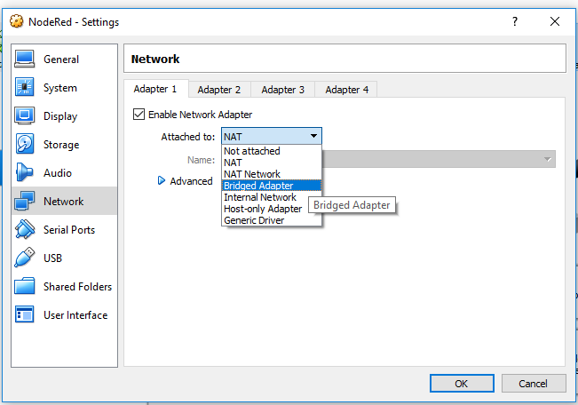
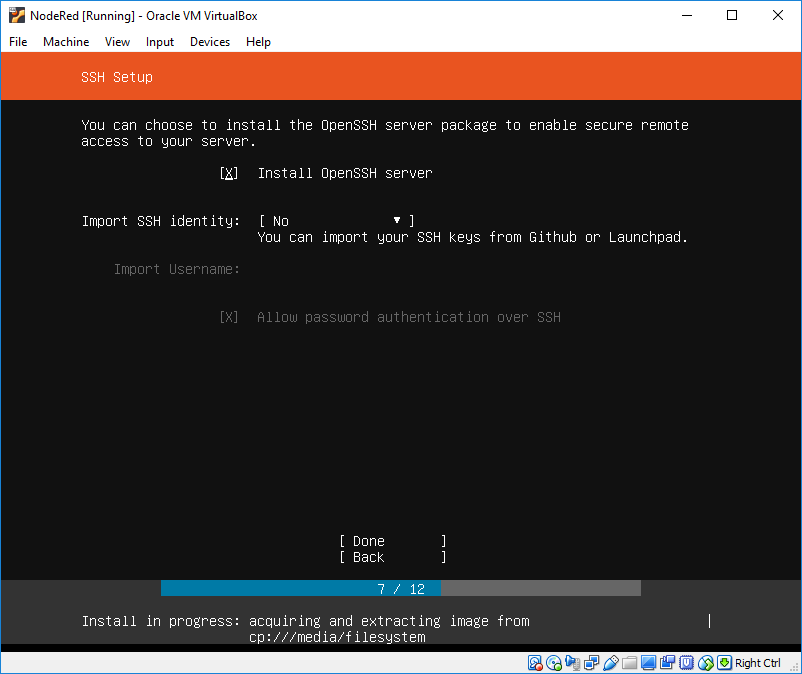
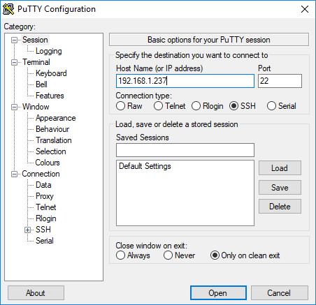

# Настройка единого сервера

Использовать будем [Ubuntu Server 18.04.2 LTS](https://www.ubuntu.com/download/server)  как наиболее актуальный на данный момент.

## Создание виртуальной машины


**ВАЖНО - для доступа к виртуальной машине из локальной сети выберите в настройках сети Bridged Adapter**



Для запуска установки с диска подключите скачанный образ Ubuntu Server, сохраните настройки и запускайте виртуальную машину.


## Установка Ubuntu Server


**ВАЖНО - на этом этапе желательно указать имя пользователя *best*, чтобы дальнейшая часть инструкции тоже работала без изменений.**


**Для удобства работы установите OpenSSH сервер**



**ВАЖНО - выберите в списке компонентов при помощи кнопки SPACE компонент mosquitto**


**После выбора команды Reboot Now не забудьте извлечь образ диска из виртуального привода.**


## Установка Node-Red

1. После входа в систему  обновите систему до актуального состояния:

   ```bash
   sudo apt update
   sudo apt upgrade
   ```


2. Установите вспомогательные пакеты:

   ```bash
   sudo apt install mc nano
   ```

   Теперь при помощи команды **mc**, если вы не уверенно чувствуете себя в консоли, сможете запустить [Midnight Commander](https://en.wikipedia.org/wiki/Midnight_Commander), который позволяет в более удобной форме передвигаться по файловой системе и редактировать файлы

3. Можно использовать клиент SSH [Putty](https://the.earth.li/~sgtatham/putty/latest/w32/putty.exe), чтобы в дальнейшем с удобством подключаться к виртуальной машине
   Для этого требуется посмотреть IP адрес командой

   ```bash
   ip a
   ```

   

4. Далее указать этот адрес в программе Putty и авторизоваться
   

   

   

5. Далее можно спокойно работать в командной строке, НО:

   - при выделении мышкой текст из окна автоматически копируется в буфер обмена
   - правый клик мыши вставляет текст из буфера обмена

6. Требуется установить MQTT  брокер, в нашем случае это будет **mosquitto** и разрешить доступ к серверу в брандмауэре:

   ```bash
   sudo apt install mosquitto
   sudo ufw allow 1883
   ```

7. Проверить можно легко - попробовать отправить сообщение на сервер localhost, на стандартный порт 1883, в топик, для примера, hello/world:

   ```bash
   mosquitto_pub -h localhost -p 1883 -t "hello/world" -m "Hello from ME"
   ```

   Если команда завершится без каких-либо сообщений - всё работает.

   Есть парная команда - подписаться на получение сообщений:

   ```bash
   mosquitto_sub -h localhost -p 1883 -t "#" -v
   ```

   Лучше её запускать в отдельном окне Putty, потому что пока команда работает -  работать с консолью не получится.

8. Поставить NodeJS и программу управления пакетами NPM:

   ```bash
   sudo apt install nodejs npm
   ```

   Если установка завершилась успешно, то должно будет выглядеть примерно так:

   

9. На этом этапе уже можно протестировать установку и работу. Запускаем сервер командой

   ```bash
   node-red
   ```

   

10. И заходим браузером по адресу: http://IP_FROM_3th_STAGE:1880
      

11. После проверки можно остановить сервер нажатием CTRL+C в консоли.

12. Далее требуется настроить автозапуск сервиса. Ubuntu 18.04 уже использует систему инициализации systemd, поэтому достаточно написать простой Unit файл и разрешить ему автозапуск.  Первым делом надо уточнить, что именно запускать. Команда даст **путь** до исполняемого файла: 

    ```bash
    which node-red
    ```

    

13. Путь до файла потребуется в параметре **ExecStart**, убедитесь, что он правильный.

    ```bash
    `sudo nano /etc/systemd/system/nodered.service`
    ```

    В редактор вставить или набрать текст. *Если Вы меняли имя пользователя, учитывайте это в параметрах*:

    ```bash
    [Unit]
    Description=Node-RED
    After=syslog.target network.target
    Documentation=http://nodered.org/
    
    [Service]
    Environment="NODE_OPTIONS=--max-old-space-size=128"
    Environment="NODE_RED_OPTIONS=-v"
    ExecStart=/usr/local/bin/node-red $NODE_RED_OPTIONS
    WorkingDirectory=/home/best/node-red/
    User=best
    Group=best
    Nice=10
    SyslogIdentifier=Node-RED
    StandardOutput=syslog
    Restart=on-failure
    KillSignal=SIGINT
    
    [Install]
    WantedBy=multi-user.target
    ```

    Выход из редактора - CTRL+X  и согласиться с сохранением.

    Создать каталог для хранения данных:

    ```bash
    mkdir ~/node-red
    ```

    

14. Перезагрузить конфиги:

    ```bash
    sudo systemctl daemon-reload
    ```

    

15. Разрешить автозапуск и запустить сервис Node-Red:

    ```bash
    sudo systemctl daemon-reload
    sudo systemctl restart nodered
    ```

    

16. Можно заходить браузером по адресу и начинать работать: 
    http://IP_FROM_3th_STAGE:1880