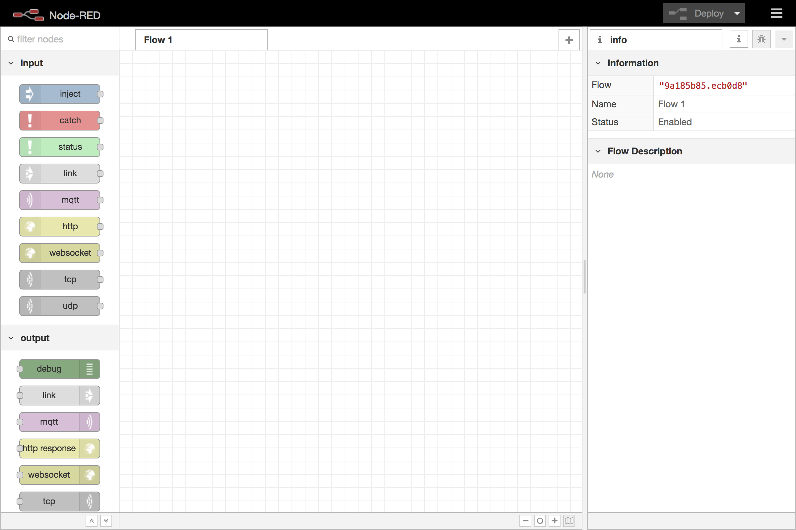
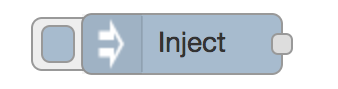

# Настройка Node-RED

Дополнительные материалы 
https://nodered.org/docs/getting-started/

Основная единица работы с логикой приложения для Node-RED - flow. Он состоит из node (минимальная единица логики), которые можно собирать вместе в большую и сложную систему обработки событий.

## Редактор

The editor window consists of four components:

The header at the top, containing the deploy button, main menu, and, if user authentication is enabled, the user menu.
The palette on the left, containing the nodes available to use.
The main workspace in the middle, where flows are created.
The sidebar on the right.

## Базовые ноды

Позволяет вручную добавлять в flow данные при работе в редакторе. Используется для отладки и тестирования.