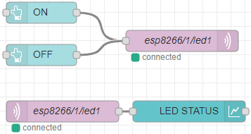

# Настройка Node-RED

Дополнительные материалы 
https://nodered.org/docs/getting-started/

Основная единица работы с логикой приложения для Node-RED - flow. Он состоит из node (минимальная единица логики), которые можно собирать вместе в большую и сложную систему обработки событий.

Для входа в систему надо узнать у инструктора адрес сервера и зайти на URL:

http://INSERT_IP_ADDRESS_HERE:1880

## Общий вид


The editor window consists of four components:

The header at the top, containing the deploy button, main menu, and, if user authentication is enabled, the user menu.
The palette on the left, containing the nodes available to use.
The main workspace in the middle, where flows are created.
The sidebar on the right.


## Предварительная настройка

Сначала надо установить дополнение `node-red-dashboard`вызывает . В правом верхнем углу страницы кнопка  вызывает меню.


Меню **Manage palette**, 

раздел по вертикали **Palette**, раздел по горизонтали **Install**


Ввести в поле поиска **node-red-dashboard,** нажать **Install**, снова **Install**


После завершения установки можно закрыть всплывающие окна (кнопка ) и перейти к настройке.

## Базовые ноды

Ноды в палитре группируются по разделам.

Самые важные для работы приложения разделы: 

- **Input** - поступление входящих сигналов 
- **Output** - отправляют сигналы в результате принятых решений
- **Function** - позволяют применить дополнительные преобразования к данным и принимать решения
- **Social** - отсылка/прием сообщений (в базовой поставке) с email и twitter, после установки дополнительных плагинов можно расширить возможности еще больше.
- **dashboard** - появляется после установки `node-red-dashboard`, содержит компоненты для постройки визуального интерфейса.

## First Flow

В рамках подготовки к работе настраивали работу контроллера с сервером по MQTT, теперь сделаем полный цикл настройки для работы с помощью Node-RED.

Первым делом надо добавить кнопку, которая будет зажигать светодиод.

Из палитры в разделе **dashboard** с помощью перетаскивания добавляем две ноды **button**  - для включения и выключения, а из раздела **output** ноду **mqtt** 

Потом соединить выходы (слева) нод button и вход (справа) ноды mqtt при помощи drag-drop мышкой.


Двойным щелчком по верхней ноде **button** откроем диалог редактирования.


1. Добавляем ui_group - группа колонок в будущем интерфейсе, в которой будет размещаться визуальный элемент, кнопкой .
   
2. Для группы надо аналогичным  образом добавить колонку (**Tab**)
   
3. **Add**

В итоге диалог будет выглядеть так:


Аналогично настроить нижнюю кнопку:


Для ноды MQTT потребуется добавить сервер. 

Параметры используйте те же, что и в config.h прошивки (уточните у инструктора)

```c++
#define mqtt_server     "2.remzalp.ru"
#define mqtt_port     9976
#define mqtt_login    "student"
#define mqtt_pass     "rtf-123"
```

Реквизиты тестового сервера уточните у инструктора, в дальнейшем будете использовать собственный сервер, который сейчас настраиваете)


Аналогично потребуется добавить сервер **mqtt-broker**:


Параметры **General / Server, Port и Security / Username, Password** уточняйте у инструктора.


Параметр **Topic** используйте тот же, что и в прошивке в параметре **mqtt_topic_in**.

Чтобы сразу посмотреть на результат, можно нажать кнопку **Deploy** . Это сохраняет текущий Flow и применяет настройки на сервере.


Чтобы посмотреть результат в визуальном режиме - **Menu / View / Dashboard**


А затем в **sidebar** на вкладке **Site** воспользоваться кнопкой  для перехода на интерфейс. Заодно на этой же панели во вкладках вкладке можно настроить дополнительные параметры отображения.


Вообще, хорошей идеей будет держать две вкладки открытыми одновременно - с редактором и графическим интерфейсом.


Можно видеть (в окне Putty), как при нажатии кнопок на MQTT сервер отправляется значение нажатой кнопки. Если контроллер включен и всё правильно настроено - время реакции на команду будет менее 1 секунды.

## Реализуем графику

Теперь дополним ноду для приёма сообщений - **input / mqtt** и ноду для вывода графики **dashboard / chart** 

В итоге должно получиться так (**параметры сервера и топика не забываем использовать свои**):

**Input / mqtt:**


**dashboard / chart**


После нажатия  **Deploy** должно получиться примерно так:



А в графическом интерфейсе (не забываем обновить страницу нажатием **F5** на клавиатуре):


Конечно, более простым методом будет сделать всё управление единственным светодиодом при помощи одной кнопки, для этого есть **dashboard / switch** :


Не забываем про **Deploy** 

Результат:


Если потребуется изменить порядок, добавить группы, колонки или ссылки, изменить размещение визуальных компонентов на экране, можно использовать **sidebar dashboard** и на вкладке **Layout** настроить всё:

